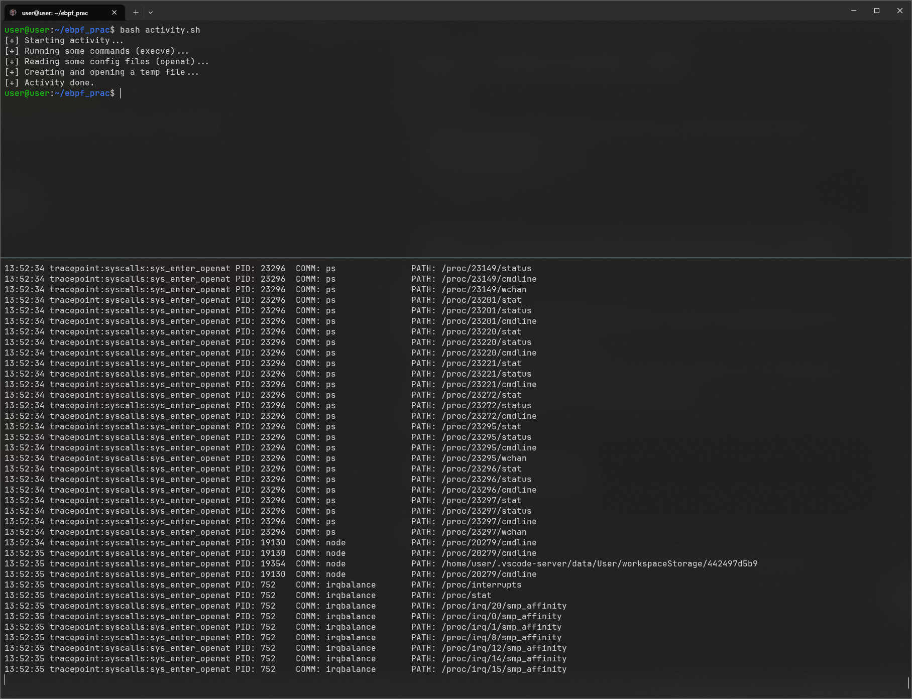

# 1. Анализ системных вызовов с eBPF

## Подготовка

1. Установить Ubuntu 22.04 в виртуальной машине (рекомендуется выставить network device на bridge для возможности подключения по ssh и др.).
2. Установить `bpftrace` и `bcc`.
3. Проверить работу `bpftrace` через команду:
   ```bash
   sudo bpftrace -e 'tracepoint:syscalls:sys_enter_execve { printf("execve: %s\n", str(args->filename)); }'
4. Протестировать работу bpftrace, открыв другой терминал и введя разные команды (напр. `ls` или `ping -q 1 8.8.8.8`). Если в первом терминале появилась информация о вводимых командах, значит все установилось успешно.

## Работа

Изучив примеры `bpf_trace.py`, `collect_all.bt`, разработайте свой скрипт (на выбор: bpftrace или Python+BCC), который:

* отслеживает релевантные системные вызовы
* выводит: человекочитаемый таймстамп, имя пробы (probe), PID, команду (comm), путь к исполняемому скрипту (filename, если применимо)

Выберите tracepoint'ы для отслеживания probe, которые кажутся вам важными:

Примеры:

```
tracepoint:syscalls:sys_enter_execve
tracepoint:syscalls:sys_enter_openat
tracepoint:syscalls:sys_enter_connect
tracepoint:syscalls:sys_enter_unlink
```

Пример работы:



## Тестирование

Написав `.bt` или `.py` скрипт, запустите его (командами `sudo bpftrace <name>.bt` или `sudo python3 <name>.py`), а на втором терминале запустите `activity.sh`.

Проверьте, что ваша трассировка корректно логгирует нужные события.

## Отчет

Что необходимо сдать:

* Ваш скрипт трассировки (`.bt` или `.py`)
* Пример логов (`sudo bpftrace <name>.bt >> <logname>.log`)
* Отчёт по шаблону `REPORT_TEMPLATE.md`

## Вопросы, на которые нужно ответить в отчете

1. Чем `tracepoint` отличается от `kprobe`?
2. Почему `args->filename` доступен не всегда?
3. Что делает `strftime("%H:%M:%S", nsecs)`?

Отправлять на `zelichenok@comsec.spb.ru`.
